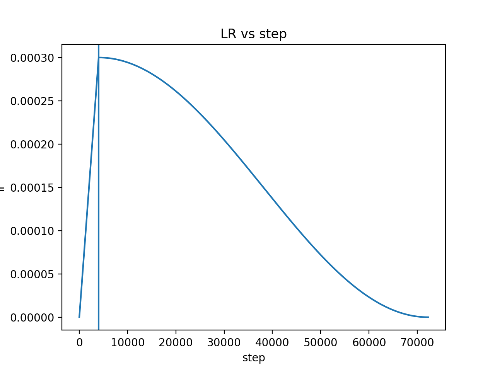
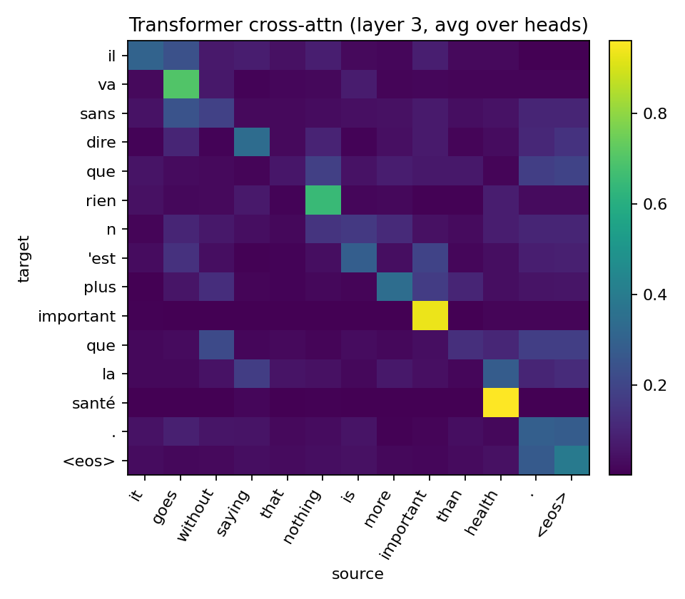

# nmt-transformer-vs-rnn
English→French NMT comparison: Transformer vs attention-based Seq2Seq (RNN). Includes BLEU evaluation, training logs (loss/LR), and attention visualizations.
---

## Results

> **Important note about BLEU**: this repo uses a **sentence-level BLEU with smoothing** (custom implementation), and the dev evaluation may run on a limited number of batches for speed. The numbers are best used for **within-repo comparison**, and are not directly comparable to official WMT sacreBLEU scores.

| Model | Best Dev BLEU | Epoch (best) | Notes |
|------|----------------|--------------|------|
| Transformer | **0.542** | **72** | greedy decoding; warmup→cosine LR |
| RNN Seq2Seq + Attention | **0.560** | **76** | greedy decoding; warmup→cosine LR |

**Transformer (this run) summary**
- Trained for **80 epochs**: train loss **6.623 → 0.203**
- Dev BLEU improves quickly in early epochs and then plateaus
- LR schedule: linear warmup to **3e-4** at **step ≈ 3999**, then cosine decay towards ~0

**seq2seq (this run) summary**
- Trained for **80 epochs**: train loss **5.688 → 0.147**
- Dev BLEU improves quickly in early epochs and then plateaus
- LR schedule: linear warmup to **3e-4** at **step ≈ 3999**, then cosine decay towards ~0

---

## Key features
- **Controlled comparison**: same task, preprocessing, padding/masking, and the same evaluation pipeline for both models
- **Logging**: saves `metrics.csv` (epoch/train_loss/dev_bleu) and `lr.csv` (step/lr)
- **Visualizations**:
  - Loss/BLEU vs epoch
  - LR vs step (warmup → cosine)
  - Cross-attention heatmaps (per-head and head-averaged)

---

## Figures

### Learning curves(left seq2seq; right transformer)

  
  

  
  

### Cross-attention (avg over heads)

  
  

---

## Attention visualization: quick observations
- **Seq2Seq** attention tends to look more “diagonal” (more direct token-to-token alignment).
- **Transformer** heads show more “division of labor”: some heads align strongly, others are more diffuse (often focusing on function words, punctuation, or longer-range relations).
- Content words like *important* / *health* often produce clear attention peaks, which matches intuition.

---

## Dataset format (matches `utils.py`)

The loader in `utils.py` reads a **UTF-8** text file where each line is:

`<source sentence><TAB><target sentence>`

- split by a TAB character (\t in code).
- After that, both sides are tokenized by `split(' ')` (space-separated tokens).
- `preprocess()` also:
  - lowercases the text
  - replaces non-breaking spaces (`\u202f`, `\xa0`) with normal spaces
  - inserts spaces around punctuation: `, . ! ? ' "`

Example (shown with `\t` for readability — in the real file it should be a literal TAB):

